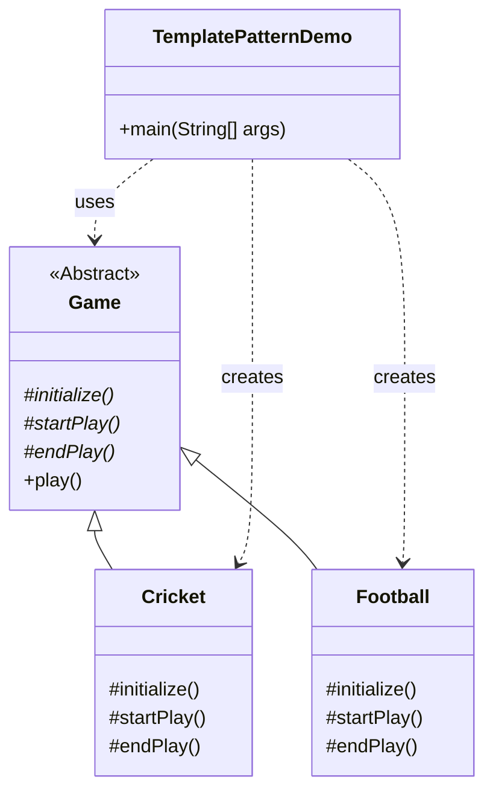

```mermaid
classDiagram
    class Game {
        <<Abstract>>
        #initialize()*
        #startPlay()*
        #endPlay()*
        +play()
    }

    class Cricket {
        #initialize()
        #startPlay()
        #endPlay()
    }

    class Football {
        #initialize()
        #startPlay()
        #endPlay()
    }
    
    class TemplatePatternDemo {
        +main(String[] args)
    }

    Game <|-- Cricket
    Game <|-- Football
    TemplatePatternDemo ..> Game : uses
    TemplatePatternDemo ..> Cricket : creates
    TemplatePatternDemo ..> Football : creates
```
